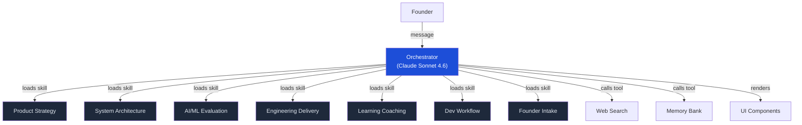
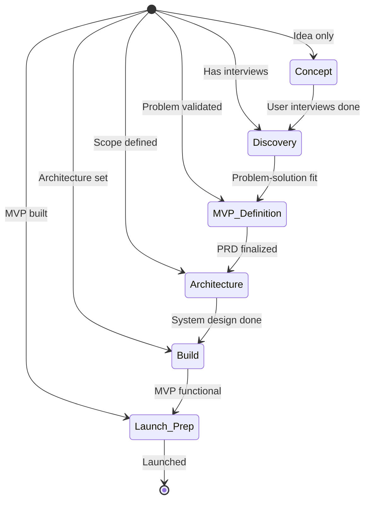
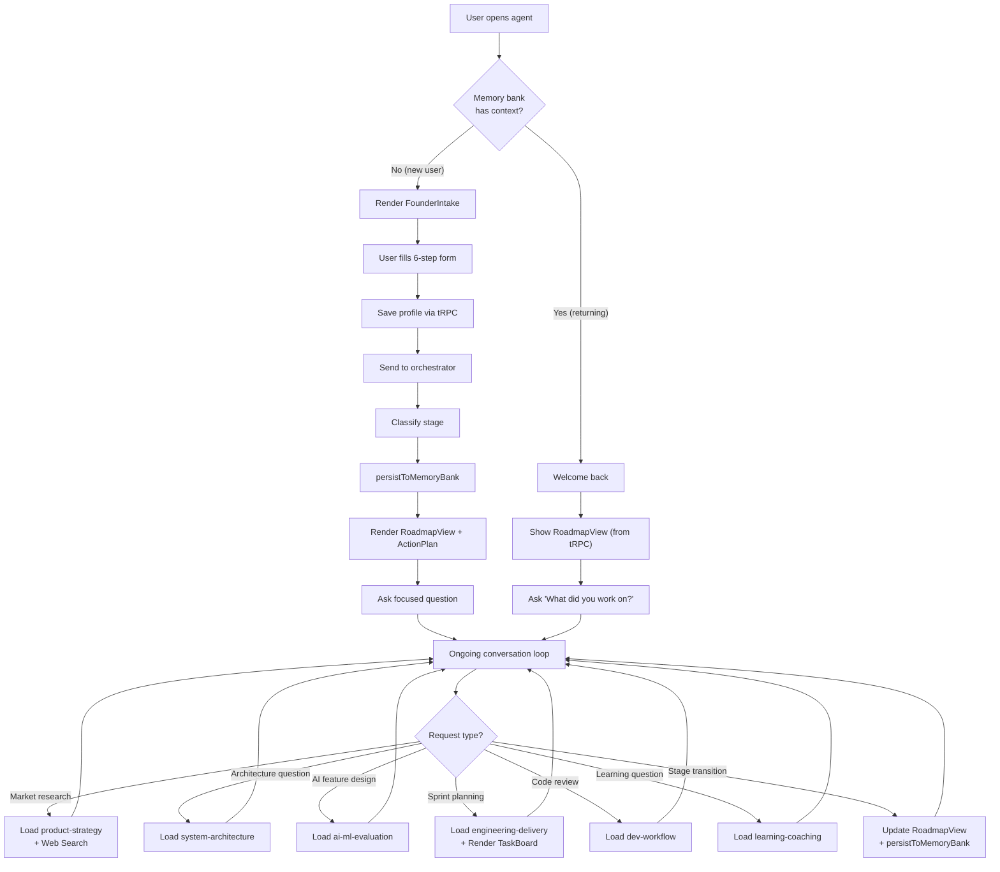
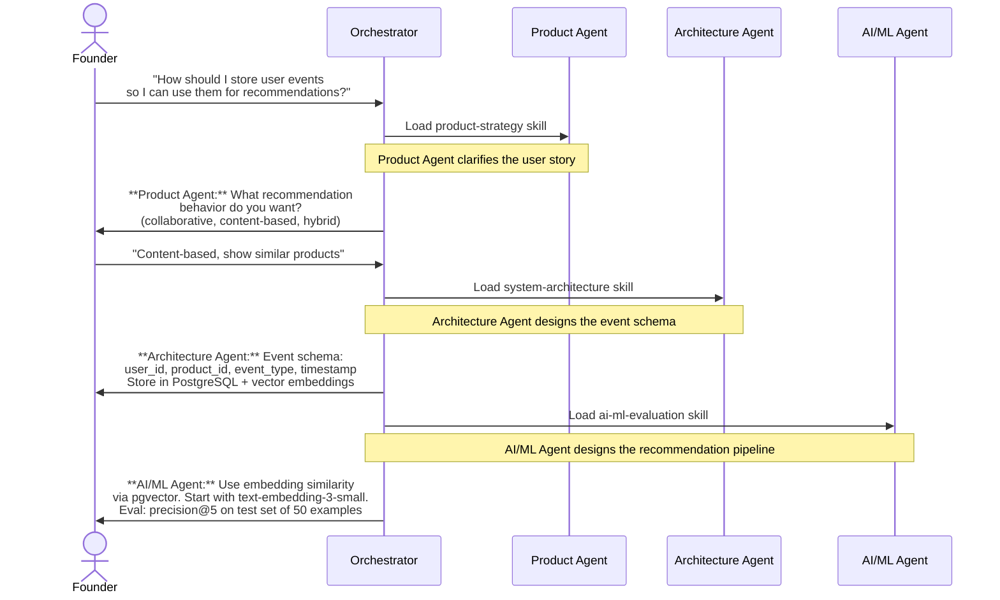

# Foundry Orbit — Agent Workflow Design

## Multi-Agent Orchestration Pattern

Foundry Orbit uses a **hub-and-spoke orchestrator pattern**: one central LLM (Claude Sonnet 4.6) decides which specialist skill to load for each user request. Skills are not separate LLM instances — they are prompt injections loaded on-demand into the same context.



## Stage-Based Guidance Flow

The orchestrator tracks the founder's stage and adapts guidance accordingly:



## User Session Lifecycle



## Multi-Agent Handoff Example

When a question spans multiple agents, the orchestrator shows explicit collaboration:



## Component Interaction Patterns

### Orchestrator-Driven (ActionPlan)
```
LLM decides content → renders component with props → user reads
No tRPC involved — pure AI-generated display
```

### Hybrid (RoadmapView, TaskBoard)
```
LLM renders initial component with props
Component also reads persisted data via useLiveQuery
User interacts → tRPC mutation → auto-invalidation → re-render
LLM sees mutations on next message via action log
```

### User-Driven (FounderIntake)
```
LLM renders empty form
User fills form → component saves via tRPC
Component sends summary to LLM via handleSendMessage
LLM processes and responds
```
