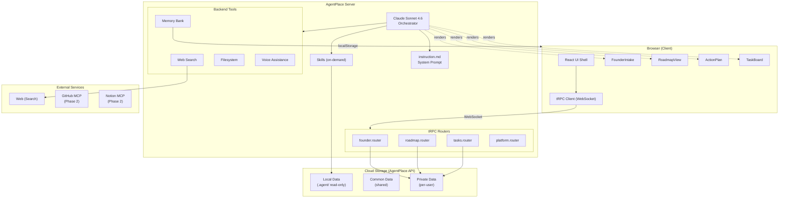
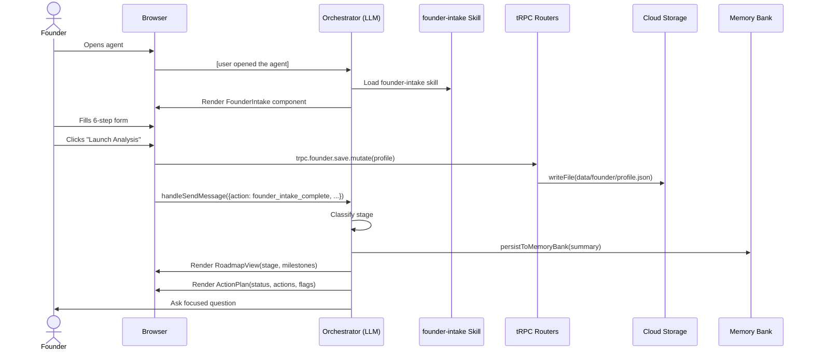
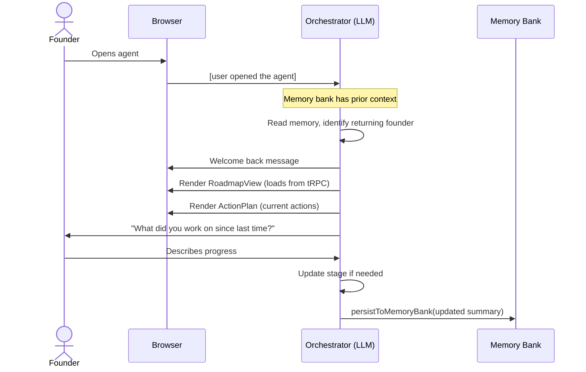
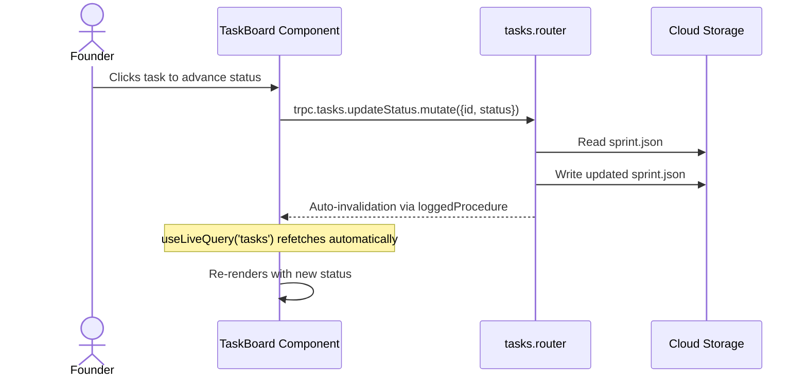
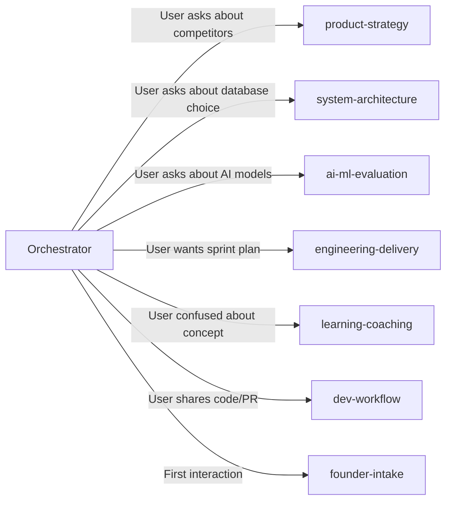

# Foundry Orbit — System Architecture

## Overview

Foundry Orbit is a multi-agent startup copilot built on AgentPlace. An LLM orchestrator (Claude Sonnet 4.6) coordinates 7 specialized agent roles via on-demand skills, persists founder state via tRPC routers backed by cloud storage, and renders rich interactive UI through registered React components.

## High-Level Architecture



## Data Flow

### First-Time User


### Returning User


### Interactive Task Status Update


## Component Architecture

| Component | Type | Data Source | Interactive? |
|-----------|------|-------------|-------------|
| FounderIntake | Form → handleSendMessage | Self-contained + tRPC save | Yes (multi-step wizard) |
| RoadmapView | Display + tRPC | Props + useLiveQuery('roadmap') | Yes (click milestones) |
| ActionPlan | Display | Props from orchestrator | No (read-only) |
| TaskBoard | Display + tRPC | Props + useLiveQuery('tasks') | Yes (click to advance status) |

## Storage Architecture

### File Layout (per user, private adapter)
```
data/
├── founder/
│   └── profile.json       # Founder profile from intake
├── roadmap/
│   └── roadmap.json        # Current stage + milestones
└── tasks/
    └── sprint.json         # Current sprint tasks
```

### tRPC Router Summary

| Router | Topic | Procedures | Storage |
|--------|-------|-----------|---------|
| `founder` | `founder` | `get` (query), `save` (mutation), `updateStage` (mutation) | `data/founder/profile.json` |
| `roadmap` | `roadmap` | `get` (query), `save` (mutation), `updateMilestone` (mutation) | `data/roadmap/roadmap.json` |
| `tasks` | `tasks` | `getAll` (query), `saveSprint` (mutation), `updateStatus` (mutation), `movePhase` (mutation) | `data/tasks/sprint.json` |

## Skill Architecture

All 7 skills use `autoload: false` — only name/description injected into system prompt at startup. Full skill content loaded on-demand via filesystem tool when the orchestrator determines the relevant domain.



## Technology Stack

| Layer | Technology | Purpose |
|-------|-----------|---------|
| LLM | Claude Sonnet 4.6 (Bedrock) | Orchestrator reasoning |
| Frontend | React + TypeScript + Tailwind | UI components |
| Backend | Node.js + tRPC | Data procedures over WebSocket |
| Storage | AgentPlace API (cloud-synced) | Persistent founder data |
| Memory | Browser localStorage | Quick context notes (15 entries) |
| Search | Anthropic Web Search | Live market/competitor research |
| Theme | Custom dark (navy/blue/amber) | Professional startup aesthetic |
