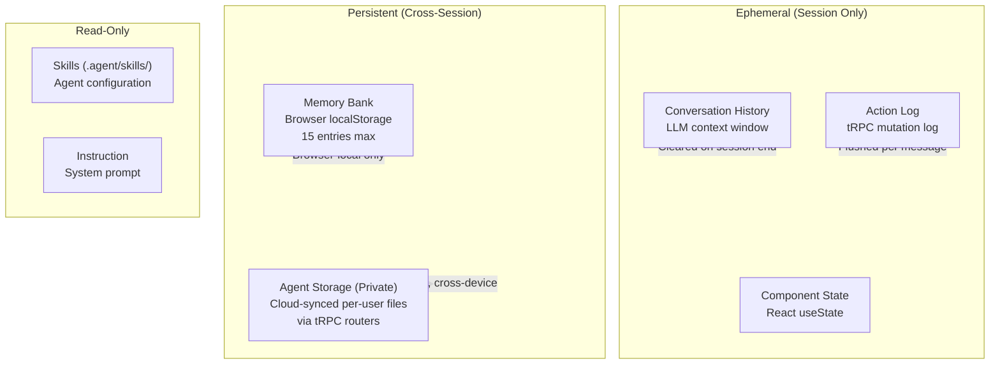
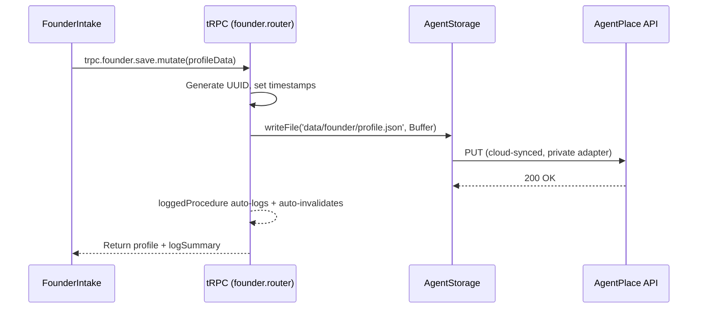
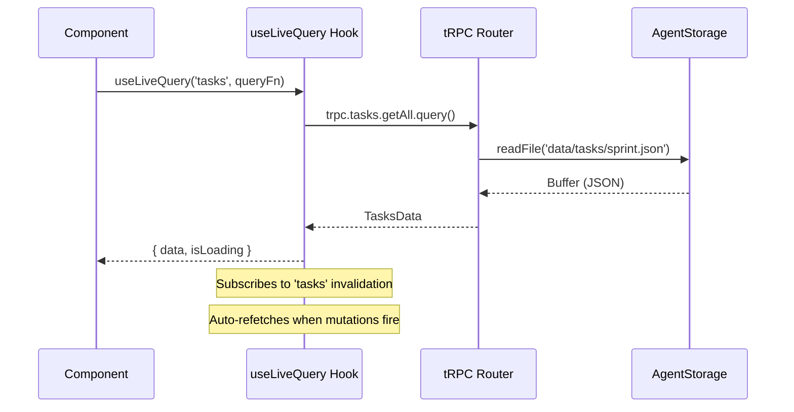
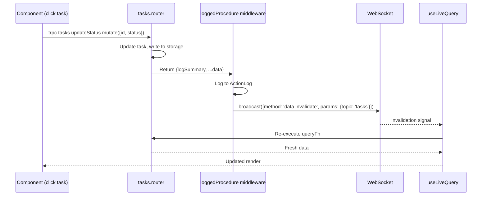

# Foundry Orbit — Data Persistence Design

## Overview

Foundry Orbit uses a layered persistence strategy to ensure founder context survives across sessions, devices, and browser states.

## Storage Layers



## Data Models

### FounderProfile
```typescript
type FounderProfile = {
  id: string;              // UUID, generated on first save
  idea: string;            // 3-5 sentence idea description
  userAndProblem: string;  // Target user and pain point
  currentStage: string;    // Classified stage (concept, discovery, etc.)
  skills: string[];        // Technical skills selected
  timeHorizon: string;     // Time availability
  teamSize?: string;       // Optional team description
  budget?: string;         // Optional budget range
  domain?: string;         // Product type (b2b_saas, consumer, dev_tool, etc.)
  goalType?: string;       // Primary goal (find_pmf, build_foundation, etc.)
  repoUrl?: string;        // GitHub repository URL
  notionUrl?: string;      // Notion workspace URL
  createdAt: number;       // Unix timestamp of first save
  updatedAt: number;       // Unix timestamp of last update
};
```

### RoadmapData
```typescript
type RoadmapData = {
  currentStage: string;    // Active stage
  milestones: Milestone[];
  updatedAt: number;
};

type Milestone = {
  id: string;              // Unique ID (e.g., "m-1", "m-2")
  stage: string;           // Which stage this belongs to
  title: string;           // Milestone description
  status: 'done' | 'in_progress' | 'upcoming';
  targetWeek?: string;     // e.g., "Week 1", "Week 2-3"
  notes?: string;          // Optional notes or blockers
};
```

### TasksData
```typescript
type TasksData = {
  sprintName: string;      // e.g., "Sprint 1 — Foundation"
  tasks: TaskItem[];
  updatedAt: number;
};

type TaskItem = {
  id: string;              // UUID
  title: string;           // Action-oriented task title
  owner: string;           // "You" or agent name
  difficulty: 'S' | 'M' | 'L';
  phase: 'now' | 'next';  // Which column
  status: 'todo' | 'in_progress' | 'done' | 'blocked';
  notes?: string;
  dependencies?: string;
  sprintName?: string;
  createdAt: number;
  updatedAt: number;
};
```

## Persistence Flow

### Write Path (FounderIntake → Storage)


### Read Path (Component → Storage)


### Invalidation Flow


## Memory Bank vs Agent Storage

| Aspect | Memory Bank | Agent Storage (tRPC) |
|--------|------------|---------------------|
| **Where** | Browser localStorage | Cloud API (AgentPlace) |
| **Capacity** | 15 entries, overwritten | Unlimited files |
| **Cross-device** | No | Yes |
| **Access** | LLM tool (persistToMemoryBank) | Components via tRPC |
| **Use case** | Quick context notes for LLM | Structured persistent data for UI |
| **Visibility** | LLM reads on session start | Components via useLiveQuery |

Both are used together:
- **Memory Bank**: LLM reads on session start to know the founder's context quickly
- **Agent Storage**: Components read structured data (profile, roadmap, tasks) via tRPC for interactive UI
